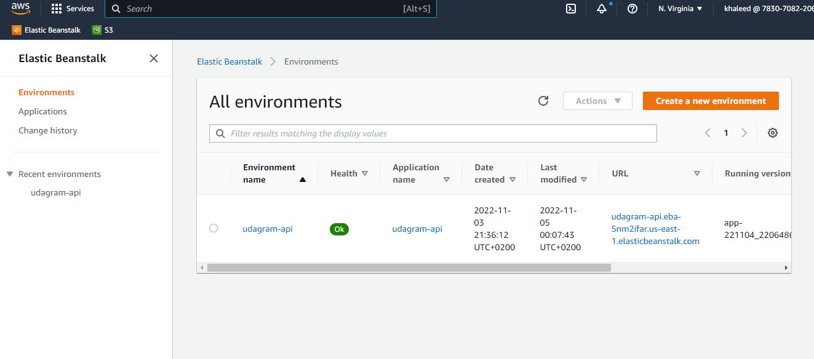
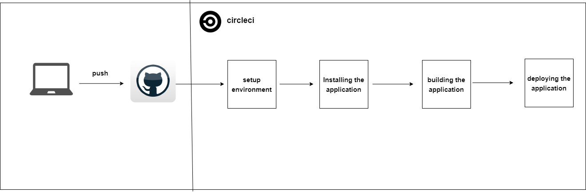

### FrontEnd Deploy Script: 

    aws s3 cp --recursive ./www s3://udagram-front/

# S3 Frontend (udagram-front)

### BackEnd Deploy Script:
 
    - eb init udagram-api --platform node.js --region us-east-1

    - npm run build

    in ./elasticbeanstalk/config.yml add :
    deploy:
    artifact: www/Archive.zip

    - eb create --sample udagram-api
    - eb use udagram-api
    - eb deploy

# Elastic Beanstalk

# Elastic Beanstalk ENV

# Elastic Beanstalk Health

    
### Pipeline Jobs: 

## 1- Install Dependencies for Front & BackEnd Commands:
    
   - cd udagram-api && npm install
   - cd udagram-frontend && npm install -f

# Pipeline diagram

# Pipline main steps

    
## 2- Build BackEnd & FrontEnd Commands:
    
   - cd udagram-api && npm build
   - cd udagram-frontend && npm build

# CircleCI Build steps

## 3- Deploy FrontEnd & BackEnd Commands:
   
   - cd udagram-api && npm deploy
   - cd udagram-frontend && npm deploy

# CircleCI Deploy step

## CircleCI Environment Variables

