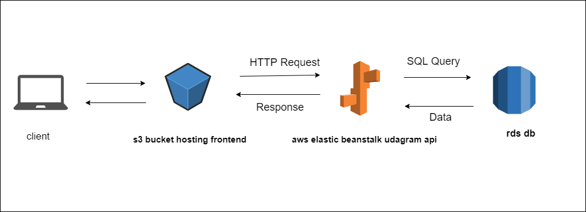
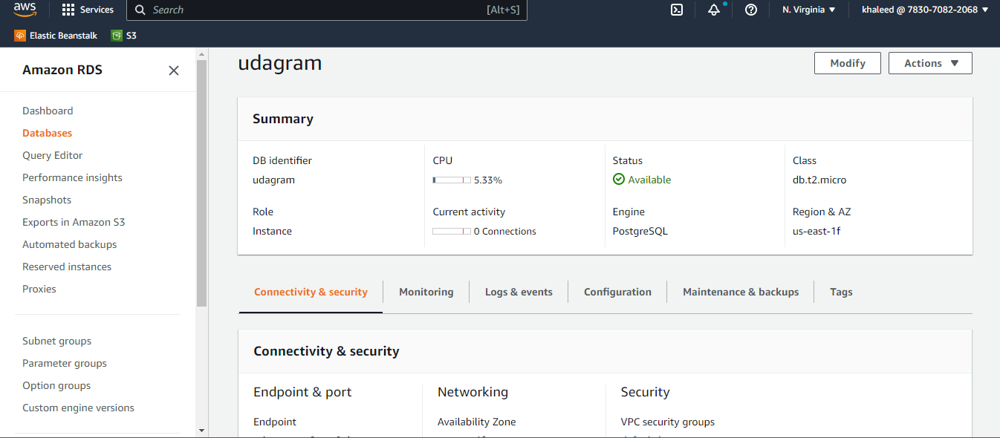
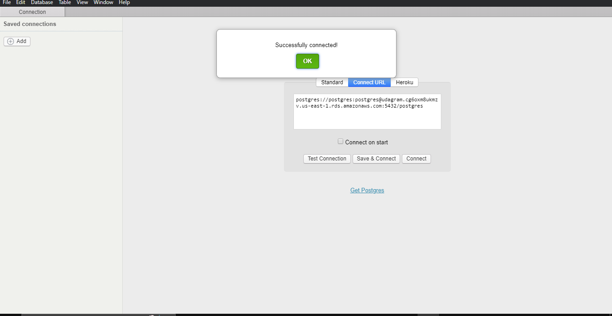

### AWS

* This website is being hosted on AWS.
* Elastic Beanstalk is used to set up the Backend API.
* S3 bucket for hosting frontend.
* RDS database running Postgres.

## high-level overview of the infrastructure

### FrontEnd Enviroment: 

* S3 BucketName: udagram-front
    
    S3 URL: `http://udagram-front.s3-website-us-east-1.amazonaws.com/`

### BackEnd Enviroment: 

## DataBase

# AWS RDS (postgres)

DB ENDPOINT: `udagram.cg6oxm8ukmzv.us-east-1.rds.amazonaws.com`

* RDS Test connection

## Elastic Beanstalk

* Application Name [EB_APP]: udagram-api
* Enviroment Name [EB_ENV]: udagram-api

    EB URL: `http://udagram-api.eba-5nm2ifar.us-east-1.elasticbeanstalk.com/`

### Deployment Pipeline Enviroment:

* CircleCI
* GitHub Repo: `https://github.com/khaleed2002/full-stack-deployment`